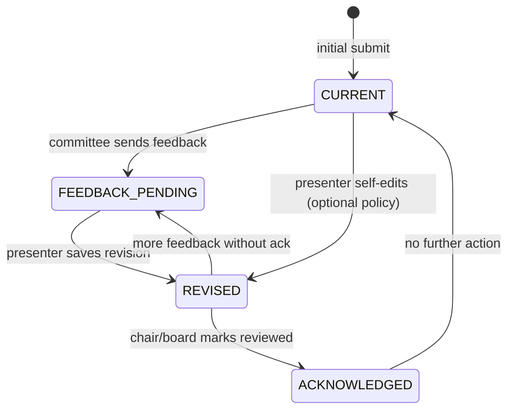

# Conference demo v2 — implementation plan

**Branch:** `feature/conference-demo-v2` (from `main`)  
**Status:** In progress — Phases 1–5 complete  
**Primary goals:**

1. Let speaking participants revise abstracts with full lineage, and let board/co-chair members give structured feedback during scoring—surfacing revised content for re-review and optional rescoring.
2. Let submitters **propose conference themes** that other submitters can reuse, with **admin curation** (edit / remove) in the site admin panel—reducing reliance on a fixed admin-only taxonomy and enabling more flexible, self-service tagging.
3. **Bias-reduced committee review** — hide presenter identity (name, company, email) on the scoring UI until a scorer chooses to reveal it; hide committee scores on the chair program view until that approver has scored the talk themselves.
4. **Sponsor session flagging** — board members mark submitted talks as sponsored sessions for capacity planning and program labeling.
5. **Board email communications** — global email templates (deck calls, reminders, declines, attendee reminders, feedback requests) with per-conference send history, batch rounds, and deduplicated decline waves.
6. **Chair coverage heatmaps** — heatmap visuals on the program and balance tabs: one below **Theme coverage**, one below **Technicality balance**, for at-a-glance density patterns.

This document turns the v2 theme into concrete data model, workflow, and phased delivery. It extends the roadmap item [Abstract revision workflow](roadmap.md#abstract-revision-workflow) with committee feedback, version history, rescoring queue, **community-driven theme taxonomy**, and [blind / conflict-aware scoring](roadmap.md#blind-and-conflict-aware-scoring) (identity + score masking only in v2).

---

## 1. Problem statement

Today the conference demo is optimized for a one-shot CFP → score → approve flow:

| Actor | Today | Gap |
|-------|--------|-----|
| **Presenter** (`/presenter/{token}`) | View status, withdraw, upload deck after approval | Cannot edit title, abstract, bio, themes, or technical level after submit |
| **Board / co-chair** (`/review/{token}`) | Score 0.0–1.0 with optional **private** notes on `Score` | Notes are not shared with presenters; no way to ask for abstract changes or give general feedback |
| **Chair** (`/chair/{token}`) | Sees all reviewer scores + notes in program detail | No signal that abstract text changed since scores were entered |
| **Scoring queue** | “Needs your score” = no `Score` row for this reviewer | Revisions do not bump talks back into the queue |
| **Presenter / submit** | Pick up to three themes from an **admin-defined** list only (`Theme` + `ThemeMultiSelect`) | No way to suggest new taxonomy labels; admins must pre-seed every tag |
| **Admin** (`/admin/{token}`) | Create/edit/delete themes and set coverage targets | No distinction between official vs community-proposed tags; no moderation of presenter suggestions |
| **Review** (`/review/{token}`) | Talk cards show **name, organization**, and **committee aggregate** before scoring | Identity visible by default; averages can anchor scores before the reviewer forms their own view |
| **Chair / board** (`/chair/{token}`) | Program list sorted by **average score**; per-talk breakdown of every reviewer’s score | Approvers can approve/decline using others’ scores before submitting their own |
| **Sponsor talks** | `Submission.isSponsorSession` exists; capacity math uses it | **No board UI** to flag/unflag; seed-only today |
| **Email** | `lib/email-stub.ts` fires on approve only | No template library, no board send UI, no per-conference send log or multi-round decline |
| **Chair balance** | `ThemeGapPanel` list + `TechnicalityBalance` bar chart | No matrix/heatmap view of theme × status or technicality × theme density |

Real committees often iterate on abstract wording before final approval. Reviewers need to comment on *what to change*, presenters need to apply edits safely, and the committee needs to know *which version* was scored and when to score again.

---

## 2. Goals and non-goals

### Goals (v2)

1. **Presenter abstract editing** — Presenters can update submission content within policy (fields, windows, program status).
2. **Committee feedback to presenters** — Board and co-chairs can leave feedback during review (abstract-specific and general), visible on the presenter portal.
3. **Lineage** — Every presenter save creates an immutable revision snapshot; chair/review UIs show version number and “what changed.”
4. **Re-review / rescoring queue** — After a meaningful edit, the talk re-enters committee attention (badge + optional “needs rescore” per reviewer).
5. **Edit / review status** — A dedicated status (or flag set) so workflows do not overload `ProgramStatus` (`PENDING`, `APPROVED`, etc.).
6. **Presenter-proposed taxonomy** — Submitters can propose new theme labels at submit or edit time; proposals become selectable for all other submitters; admins can rename, retarget, or remove proposals without breaking historical data.
7. **Bias-reduced scoring** — On `/review`, presenter **name**, **company** (`organization`), and **email** are hidden by default with an explicit **Reveal identity** control. On `/chair`, **committee scores** (aggregate and per-reviewer breakdown) stay hidden for a given talk until the logged-in board member has saved their own score for that submission.
8. **Sponsor session flag** — Board toggles `isSponsorSession` on any submission from the chair program UI; reflected in badges, filters, and `CapacityWidget` sponsor counts.
9. **Email templates & send tracking** — Global templates for standard committee communications; board sends per active conference with batch history, timestamps, and non-duplicative decline rounds (demo: `sendEmailStub` + DB log).
10. **Coverage heatmaps** — On `/chair/{token}`, render a **theme coverage heatmap** directly under `ThemeGapPanel` and a **technicality heatmap** directly under `TechnicalityBalance` (program and balance tabs where those panels appear).

### Non-goals (v2 — defer)

- Production SMTP / SendGrid (v2 implements templates, merge fields, send **logging**, and console stub delivery; wire real provider later per [roadmap](roadmap.md#real-email-and-calendar)).
- SSO / structured identity (still token URLs).
- Full conflict-of-interest registry (declare/recuse per talk); only identity/score masking in v2.
- Editing after `WITHDRAWN` or wholesale unlock of approved program slots without explicit board action.
- Automated diff NLP; plain text diff or field-level “previous vs current” is enough for the demo.
- Theme merge/dedup automation (admin manually consolidates duplicate proposals).
- Voting or ranking of proposed themes by the community.
- In-room attendee feedback via QR codes — see [Conference backlog](conference-backlog.md) (BL-1).

---

## 3. Current baseline (main)

Relevant models and routes today (`prisma/schema.prisma`, `docs/architecture.md`):

- **`Submission`** — Single row holds live `title`, `abstract`, `bio`, `technicalLevel`, presenter fields, `programStatus`, deck fields.
- **`Score`** — One row per reviewer per submission; `value` + optional `notes` (committee-only; shown on chair dashboard and CSV, not on presenter portal).
- **`PresenterPortal`** — Withdraw + deck upload when `APPROVED`; no edit form.
- **`POST /api/submissions`** — Create only; no `PATCH` for presenters.
- **`POST /api/scores`** — Upsert score; no feedback channel to presenter.
- **`Theme`** — Admin-created only (`POST` / `PATCH` / `DELETE` `/api/admin/themes`); `targetMin` / `targetMax` for chair gap analysis; presenters select via `ThemeMultiSelect` on `/submit/{slug}`.
- **`SubmissionTheme`** — Join table (max three themes per talk).
- **`ReviewPanel`** — Renders `firstName`, `lastName`, `organization`, and committee **aggregate** on every card (`components/ReviewPanel.tsx`).
- **`ChairDashboard`** — Program tab shows `email`, aggregate, and `allScores` per talk before the viewer has necessarily scored (`components/ChairDashboard.tsx`); list order uses `sortByAggregate` (`lib/submissions.ts`).
- **`isSponsorSession`** — On `Submission`; excluded from community slot targets in `lib/capacity.ts`; not editable in UI.
- **`email-stub.ts`** — Single hard-coded `abstract-approved` helper; no template registry or send audit.
- **`ThemeGapPanel` / `TechnicalityBalance`** — Chair program tab (theme panel only) and balance tab (both); data from `lib/theme-stats.ts` and `lib/program-balance.ts` (`components/ChairDashboard.tsx`).

**Program status** remains the source of truth for *program placement* (`PENDING` → `APPROVED` / `DECLINED` / `BACKUP` / `WITHDRAWN`). v2 adds a **parallel abstract review state** rather than overloading program status.

**Taxonomy** remains a single `Theme` table in v2—extended with source and visibility flags rather than a separate “proposal” entity that must be promoted before use (see §4.5).

---

## 4. Proposed domain model

### 4.1 `AbstractReviewStatus` (new enum on `Submission`)

Tracks the abstract/content lifecycle separately from `ProgramStatus`:

| Value | Meaning | Typical next step |
|-------|---------|-------------------|
| `CURRENT` | Live content matches last committee “ack” (or initial submit); no pending presenter edit | Normal scoring |
| `FEEDBACK_PENDING` | Committee left presenter-visible feedback; presenter has not submitted a revision | Presenter edits |
| `REVISED` | Presenter saved a new revision; committee should review latest text | Rescoring / re-review |
| `ACKNOWLEDGED` | Committee marked revision reviewed (optional); scores may stand or be updated | Back to `CURRENT` |

**Transitions (simplified):**

**Open product choice:** Can presenters edit without prior feedback (`CURRENT` → `REVISED` directly), or only after `FEEDBACK_PENDING`? **Recommendation for demo:** allow self-service edits while `programStatus` is `PENDING` or `BACKUP`; require board “unlock” or feedback thread before edits when `APPROVED` (deck phase)—see §6.

Fields on `Submission`:

- `abstractReviewStatus AbstractReviewStatus @default(CURRENT)`
- `abstractVersion Int @default(1)` — increments on each presenter save that changes tracked fields
- `abstractVersionAcknowledgedAt DateTime?` — last time committee cleared `REVISED` (optional)
- `lastPresenterEditAt DateTime?`

### 4.2 `SubmissionRevision` (new table)

Immutable snapshots for lineage.

| Column | Notes |
|--------|--------|
| `id` | cuid |
| `submissionId` | FK |
| `version` | Matches `Submission.abstractVersion` at save time |
| `title`, `abstract`, `bio`, `technicalLevel` | Copied values **before** or **after** save (pick one convention; recommend **after** save so version N = content reviewers see) |
| `themeIds` | JSON array of theme IDs at this version |
| `changedFields` | JSON string[] e.g. `["abstract","title"]` for UI badges |
| `changeNote` | Optional presenter comment (“clarified methodology”) |
| `createdAt` | |

Indexes: `(submissionId, version)` unique.

**Lineage rules:**

- Version `1` is created on initial `POST /api/submissions` (or backfilled in seed).
- Each presenter `PATCH` that changes any tracked field: insert `SubmissionRevision`, bump `abstractVersion`, set `abstractReviewStatus = REVISED`, set `lastPresenterEditAt`.

### 4.3 `PresenterFeedback` (new table)

Structured committee → presenter messages (distinct from private `Score.notes`).

| Column | Notes |
|--------|--------|
| `id` | cuid |
| `submissionId` | FK |
| `reviewerAccessId` | FK |
| `kind` | `ABSTRACT` \| `GENERAL` |
| `body` | Text (Zod max length, e.g. 5000) |
| `abstractVersion` | Version this feedback refers to (nullable for general) |
| `createdAt` | |

When feedback is saved:

- Set `abstractReviewStatus` to `FEEDBACK_PENDING` if not already `REVISED`.
- Stub email: “New feedback on your submission.”

**Migration note:** Existing `Score.notes` stay private scoring notes. Optionally add UI copy: “Private score note” vs “Feedback to presenter.” Do not auto-migrate old notes to `PresenterFeedback`.

### 4.4 `Score` extensions (rescoring)

Add optional column:

- `scoredAbstractVersion Int?` — Set to `submission.abstractVersion` on each upsert.

**Per-reviewer rescoring:**

- “Needs your score” if no score **or** `scoredAbstractVersion < submission.abstractVersion`.
- “Scored (outdated)” optional third bucket when score exists but version is stale—helps demo clarity.

Chair aggregate: show min/max `scoredAbstractVersion` across committee or flag “scores may predate revision v3.”

### 4.5 Presenter-proposed taxonomy (`Theme` extensions)

Extend the existing `Theme` model so admin and community tags share one join path (`SubmissionTheme`) and one chair coverage pipeline (`lib/theme-stats.ts`).

#### New fields on `Theme`

| Column | Notes |
|--------|--------|
| `source` | `ADMIN` (default, seed + admin panel) \| `PRESENTER` |
| `proposedBySubmissionId` | Nullable FK; set when a presenter creates the theme |
| `proposedAt` | Nullable; set on presenter create |
| `removedAt` | Nullable soft-remove; hidden from submit/edit pickers but kept for historical joins |
| `usageCount` | Optional denormalized count for admin list (or compute via `_count.submissions`) |

Keep existing: `slug`, `name`, `targetMin`, `targetMax`, `sortOrder`, `conferenceId`.

#### Slug and deduplication

- On propose: derive `slug` from normalized name (`lib/slug.ts` or existing pattern).
- **Unique** `(conferenceId, slug)` unchanged.
- If a presenter proposes a name that matches an existing theme (case-insensitive), **select the existing row** instead of creating a duplicate; return that `id` to the client.

#### Visibility rules

| `source` | Selectable on submit/edit | Shown in admin panel | Default `targetMin` / `targetMax` |
|----------|---------------------------|----------------------|-----------------------------------|
| `ADMIN` | Yes (if not removed) | Yes; “Official” badge | Admin-set |
| `PRESENTER` | Yes (if not removed) | Yes; “Community proposed” badge | `0` / `0` until admin sets targets |
| Any + `removedAt` set | **No** for new picks | Yes; strikethrough / “Removed” | Unchanged |

**Removal policy:** Prefer **soft remove** (`removedAt`) so approved/pending talks that already use the theme retain valid FKs. Chair theme filter and coverage stats still count submissions on removed themes (label suffix “(removed)” in UI). Hard delete remains admin-only when **zero** submissions reference the theme (same as today).

#### Presenter propose flow (atomic with theme pick)

1. Presenter types a new theme name in “Propose a theme…” (submit form or presenter editor).
2. `POST /api/themes/propose` (public, rate-limited) or inline in `POST /api/submissions` / `PATCH /api/presenter/submission`:
   - Validates name length, conference active, submission window (or edit policy).
   - Creates `Theme` with `source = PRESENTER`, `proposedBySubmissionId`, `proposedAt = now()`.
   - Returns `theme.id` for immediate inclusion in the talk’s theme list (still max 3 total).
3. All later submitters see the theme in `ThemeMultiSelect` alongside official themes (grouped or badged).

**Attribution (demo):** Optional subtitle “Suggested by a speaker” without exposing PII; admin list may show proposer submission id for moderation only.

#### Admin curation (`/admin/{token}`)

Extend **Theme taxonomy** section in `AdminDashboard.tsx`:

| Action | Official (`ADMIN`) | Community (`PRESENTER`) |
|--------|--------------------|-------------------------|
| Edit display name | Yes | Yes |
| Edit `targetMin` / `targetMax` | Yes | Yes (admin sets when theme gains traction) |
| Remove from picker | Soft-remove | Soft-remove |
| Hard delete | If zero usage | If zero usage |
| Convert source | N/A | Optional “Promote to official” → `source = ADMIN` (clears proposer FK optional) |

Reuse `/api/admin/themes` with role checks (`canManageThemes`); add `PATCH` fields for `name`, targets, `removedAt`, and `source`. Presenter propose uses a **separate** public route so submitters never receive admin tokens.

#### Chair / review impact

- Theme coverage and program filters unchanged—community themes are first-class `Theme` rows.
- Filter chips may show counts per theme including presenter-proposed tags.
- If admin removes a theme from the picker, existing talks keep the tag; chair sees “(removed)” on that label.

### 4.6 Bias-reduced scoring (identity + chair score masking)

Reduce anchoring and identity bias while keeping information available when the committee explicitly asks for it. Implement **server-side omission** (not CSS-only hiding) so view-source and network responses do not leak masked fields by default.

#### Conference toggle (optional)

| Field | Notes |
|--------|--------|
| `Conference.blindReviewEnabled` | `Boolean @default(true)` — when false, v1 behavior for demos/compare |

Admin panel may expose this under conference settings (optional v2 polish).

#### A. Review UI — hidden presenter identity

**Hidden by default** on `/review/{token}` (board and co-chair scorers):

| Field | Maps to |
|-------|---------|
| Presenter name | `firstName`, `lastName` |
| Company | `organization` |
| Email | `email` (add to review list payload; not shown in UI today but must not leak via API) |

**Still visible** (content-focused review):

- `title`, `abstract`, `technicalLevel`, theme names, `programStatus`, submission date, revision badges (v2), degrees (optional—see open questions), co-presenter names if present (optional mask later).

**Reveal control**

- Per-talk button: **Reveal identity** → fetches or expands identity block for that submission only.
- Optional session toggle: **Reveal identity on all talks** (same token session; stored client-side for UX only—each reveal still logged server-side if audit is added).
- After reveal, show: “Jane Doe · Acme Corp · jane@example.com” with **Hide again** to re-mask (client clears local reveal state; server does not need to “un-reveal”).

**Committee aggregate on review (aligned with chair rule)**

- Hide the “Committee aggregate: avg …” line until `myScore != null` for that talk (prevents score anchoring before the reviewer scores).
- After save, show aggregate (and on rescoring, hide again until `scoredAbstractVersion` catches up—same rule as rescoring queue §6.4).

**API / loaders**

- Extend `SubmissionListItem` with optional `identity: { firstName, lastName, organization, email } | null` and `aggregate: … | null` (null when masked).
- `lib/review-queue.ts` (or extend `toListItem`): `maskForReviewer(item, reviewerAccessId, options)` strips identity and aggregate when policy applies.
- `GET /api/review/submissions/{id}/identity?token=` — returns identity only after explicit reveal (rate-limited); used by client reveal button. Alternative: single endpoint with `?revealIdentity=1` query param.

**CSV export / chair** — unchanged; full data for operational export (board already scored or export is post-hoc).

#### B. Chair UI — hidden scores until self-score

Applies to users who **both score and approve** (`BOARD` on `/chair/{token}`). Co-chairs (`CHAIR`) use chair for decks; they also score on `/review`—mask chair scores for them too if they have a `Score` row capability (same rule: no committee scores until `myScore` exists).

**Hidden until the viewer has scored the talk**

| Element | Today |
|---------|--------|
| Row subtitle with `email` | Shown in program detail |
| `Score: avg X.XX (N reviewers)` | Shown before own score |
| Per-reviewer `allScores` list (name, value, notes) | Shown before own score |
| Sort key | `sortByAggregate` — leaks relative rank via ordering |

**Visible before own score**

- Talk title, abstract snippet, themes, technical level, program status, revision/feedback badges, approve/decline controls (board), theme coverage widgets that do not expose per-talk averages for **unscored-by-me** rows.

**After `myScore` is set** (and on rescoring, after rescore at current `abstractVersion`):

- Show aggregate, full `allScores` breakdown, and include talk in **score-sorted** program ordering.

**Sort behavior**

| Viewer state | Program tab order |
|--------------|-------------------|
| Has not scored talk T | Group “Awaiting your score” (e.g. by `createdAt` desc) or interleave without rank hint |
| Has scored talk T | Sort T among others by aggregate per existing `sortByAggregate` |
| Mixed list | Partition: unscored-by-me first (no avg shown), then scored-by-me sorted by aggregate |

Implement via `partitionChairProgramByOwnScore` in `lib/submissions.ts` and chair page loader using the board member’s `reviewerAccessId`.

**API**

- Chair page data loader passes `viewerReviewerAccessId` and applies masking server-side before props reach `ChairDashboard`.
- Do not rely on client-only filtering of props already containing scores.

#### C. What stays unmasked

| Surface | Identity | Others’ scores |
|---------|----------|----------------|
| `/review` (default) | Hidden | Hidden until own score |
| `/review` (after reveal) | Shown for that talk | Hidden until own score |
| `/chair` program (board, unscored) | May show name/email for logistics, or mask identity too—**tentative: keep name on chair for approve context, hide email until scored** | Hidden |
| `/chair` program (board, scored) | Full row | Shown |
| `/chair` deck tab | Unchanged | N/A |
| CSV export | Full | Full |
| Presenter portal | Own data | N/A |

**Tentative chair identity:** Board approvers still see **presenter name** on chair rows (scheduling familiarity) but **not email** until they have scored; optional future: mask name on chair too. Review UI always masks name/company/email.

#### D. Audit (optional, demo-light)

`ReviewIdentityReveal` log: `reviewerAccessId`, `submissionId`, `revealedAt` — console stub or table for roadmap audit log. Not required for MVP.

### 4.7 Sponsor session flag (board)

Use the existing `Submission.isSponsorSession` field—no schema rename required. Sponsored talks count toward `sponsorMin`–`sponsorMax` on the capacity widget and are excluded from the community approved cap (`lib/capacity.ts`).

#### Board actions (chair program tab)

| Control | Behavior |
|---------|----------|
| **Mark as sponsor** / **Clear sponsor** toggle | Board only (`canApproveProgram`); available for any non-`WITHDRAWN` submission |
| Sponsor badge | Visible on chair program rows, review cards, and optional program filter “Sponsor sessions” |
| Capacity widget | Live update of `sponsorSessionCount` vs conference `sponsorMin` / `sponsorMax` |

Presenters do **not** self-declare sponsor status on the public submit form (committee classification only).

#### API

- `PATCH /api/chair/sponsor-session` — body: `{ token, submissionId, isSponsorSession: boolean }`
- Validates board role + active conference; returns updated submission summary.

#### Seed

- Flag 1–2 seed talks as sponsor; verify capacity widget and filter.

### 4.8 Board email templates & conference send tracking

Operational email for board members: preview global templates, send to eligible recipients for the **current conference**, and audit what was sent when—including **multiple decline rounds** without sending twice to the same presenter in the same round.

#### Template catalog (global, cross-conference)

Stored in **`EmailTemplate`** (not tied to `conferenceId`). Seeded once; optional admin edit later.

| `templateKey` | Purpose | Typical recipients |
|---------------|---------|-------------------|
| `CALL_FOR_DECK` | Ask approved presenters to upload slides | `programStatus = APPROVED`, has presenter email |
| `DECK_REMINDER` | Remind presenters without a deck (or stale deck) | Approved, `deckStatus` null or `SUBMITTED` past N days (configurable in send UI) |
| `DECLINE` | Notify presenters their talk was not accepted | `programStatus = DECLINED` |
| `ATTENDEE_REMINDER` | Conference approaching; cancel if cannot attend so waitlist can advance | `ConferenceAttendee` rows (see below) |
| `CALL_FOR_FEEDBACK` | Post-event session / conference feedback request | Approved presenters and/or attendees (send UI picks cohort) |

Each template row:

| Column | Notes |
|--------|--------|
| `templateKey` | Enum, unique |
| `name` | Display name in UI |
| `subjectTemplate` | e.g. `Upload your deck — {{conferenceName}}` |
| `bodyTemplate` | Multi-line; merge fields (see below) |
| `updatedAt` | Optional admin edit timestamp |

**Merge fields** (render in `lib/email-templates.ts`):

- Presenter/submission: `{{presenterName}}`, `{{firstName}}`, `{{title}}`, `{{conferenceName}}`, `{{presenterPortalUrl}}`, `{{declineReason}}` (optional paragraph board adds at send time for decline batches)
- Conference: `{{conferenceName}}`, `{{eventDate}}`, `{{venue}}` (from conference fields or seed constants)
- Attendee: `{{attendeeName}}`, `{{cancelUrl}}` (demo stub link)

`DECLINE` supports **dynamic body** via optional `customIntro` per send batch merged into template.

#### Per-conference send history

**`ConferenceEmailBatch`** — one row per “Send” click (a campaign instance):

| Column | Notes |
|--------|--------|
| `id` | cuid |
| `conferenceId` | FK |
| `templateKey` | Which template |
| `round` | `Int @default(1)` — **decline rounds** increment (1, 2, 3…); other templates usually round 1 |
| `sentAt` | Timestamp |
| `sentByReviewerAccessId` | Board member who triggered send |
| `recipientCount` | Denormalized count |
| `customIntro` | Nullable; decline-only optional text |

**`EmailSendRecord`** — one row per recipient per batch (deduplication source):

| Column | Notes |
|--------|--------|
| `id` | cuid |
| `batchId` | FK → `ConferenceEmailBatch` |
| `conferenceId` | FK (query convenience) |
| `templateKey` | Redundant for indexes |
| `round` | Copied from batch |
| `submissionId` | Nullable — presenter emails |
| `attendeeId` | Nullable — attendee emails |
| `email` | Recipient address at send time |
| `sentAt` | Same as batch or per-message stub delay |

**Unique constraints (deduplication):**

- Presenter: `@@unique([conferenceId, templateKey, round, submissionId])` when `submissionId` is set
- Attendee: `@@unique([conferenceId, templateKey, round, attendeeId])` when `attendeeId` is set

**Decline rounds:** Board opens **Decline email** → selects **Round 2** → preview shows only `DECLINED` submissions with **no** `EmailSendRecord` for `(DECLINE, round: 2)`. Round 1 sends do not block round 2 to the same presenter; the same presenter never receives two emails in the **same** round.

Other templates: typically one round; “Send again” creates a **new batch** but recipient picker excludes anyone already sent that `(templateKey, round: 1)` unless board checks **Include already emailed** (off by default).

#### Conference attendee list (for attendee reminder)

**`ConferenceAttendee`** (demo registration stub):

| Column | Notes |
|--------|--------|
| `id`, `conferenceId`, `email`, `firstName`, `lastName` | |
| `registeredAt` | |
| `cancelledAt` | Nullable — excluded from reminder sends when set |

Seed a small attendee list per conference. Roadmap VIP/Eventbrite sync remains separate.

#### Board UI — Communications tab on chair dashboard

New **`Communications`** tab (`BOARD` only):

1. **Template list** — five standard templates with description.
2. Per template + conference:
   - **Last sent:** `—` or `May 12, 2026 3:42 PM (Round 1, 14 recipients)` with link to batch detail.
   - **History:** table of past batches (round, sent at, sent by, count).
3. **Send flow:** Preview (pick sample recipient) → confirm recipient count → Send → stub console + write batch + records.
4. **Decline template:** Round selector (default next unused round), optional custom intro, recipient preview list with checkboxes disabled for already-sent in that round.

Co-chairs: **no access** (board only), consistent with approve/archive.

#### Delivery

- v2: `sendEmailStub` for each recipient after DB records created (transaction: batch + records, then stub loop).
- Failures: demo marks all succeeded; production would add `status` on `EmailSendRecord` later.

#### Auto-send hooks (optional, keep manual primary)

- Existing `emailAbstractApproved` on approve may remain or delegate to `CALL_FOR_DECK` template when board enables “auto on approve” (default **off** in v2 to avoid duplicate with manual deck call).

### 4.9 Chair coverage heatmaps

Add matrix heatmaps under the existing summary panels so committee members see **patterns**, not only per-row lists and bars.

#### Placement (required)

| Location | Existing panel | New component (directly below) |
|----------|----------------|--------------------------------|
| Chair **Program** tab | `ThemeGapPanel` | `ThemeCoverageHeatmap` |
| Chair **Balance** tab | `ThemeGapPanel` | `ThemeCoverageHeatmap` |
| Chair **Balance** tab | `TechnicalityBalance` | `TechnicalityHeatmap` |

Same card stack spacing as today (`space-y-6`); heatmaps live **inside** a sibling card or as a subsection with their own heading (e.g. “Theme coverage heatmap”) so the list/chart above remains unchanged.

**Access:** Board and co-chair read-only on chair (same as balance tab today). Archived conference: read-only heatmaps from snapshot data.

#### A. Theme coverage heatmap

**Purpose:** Complement the theme list (approved vs targets) with a grid of **volume by program status** per theme.

| Axis | Values |
|------|--------|
| **Rows** | One row per `Theme` (official + community proposed, excluding soft-removed from row labels or show with “(removed)”) |
| **Columns** | `Pending` · `Approved` · `Declined` · `Backup` |
| **Cell value** | Count of submissions tagged with that theme **and** that `programStatus` (multi-theme talks contribute to each of their themes) |

**Visual**

- Sequential color scale (light → `minne-navy`): intensity ∝ count; `0` = neutral gray/white.
- Cell displays numeric count; `title` tooltip: `"{theme}: {count} approved"`.
- Optional row footer or column totals for quick scanning.
- Row order: by theme `sortOrder`, or by approved count desc (tentative: **sortOrder** to match admin taxonomy).

**Data:** `computeThemeStatusHeatmap(themes, submissions)` in `lib/chair-heatmaps.ts`, reusing the same submission→theme join logic as `computeThemeStats` (`lib/theme-stats.ts`). Input can be derived from existing `ThemeCountRow[]` plus raw status splits, or computed in one pass.

#### B. Technicality heatmap

**Purpose:** Complement the level 1–5 bar chart with **where approved technical depth sits across themes**.

| Axis | Values |
|------|--------|
| **Rows** | Technical levels `1`–`5` (labels from `TECHNICAL_LABELS`) |
| **Columns** | One column per theme (same theme set as heatmap A) |
| **Cell value** | Count of **`APPROVED`** submissions with that `technicalLevel` and that theme tag |

**Visual**

- Same color scale family as theme heatmap for visual consistency.
- Tooltip: `Level 3 · Data Viz: 4 approved talks`.
- If `approvedCount === 0`, show empty state (match `TechnicalityBalance` copy).

**Data:** `computeTechnicalityThemeHeatmap(approvedSubmissionsWithThemes)` in `lib/chair-heatmaps.ts`. Approved-only matches the bar chart above it.

#### Implementation notes

- **No new Prisma models** — computed on the chair page loader from submissions + themes already loaded.
- **Responsive layout:** horizontal scroll on narrow viewports when many theme columns; sticky row labels optional.
- **Accessibility:** `role="img"` with `aria-label` summary; table fallback or screen-reader text with top cells.
- **Filter interaction:** When program tab theme filter is active, heatmap A may either reflect **full conference** (tentative: full data) or filtered subset—document in UI subtitle if filtered.

#### Components

| Component | File |
|-----------|------|
| `ThemeCoverageHeatmap` | `components/ThemeCoverageHeatmap.tsx` |
| `TechnicalityHeatmap` | `components/TechnicalityHeatmap.tsx` |
| `HeatmapGrid` (shared) | `components/HeatmapGrid.tsx` — rows, cols, values, color scale, labels |

Wire props from `app/chair/[token]/page.tsx` into `ChairDashboard` alongside `themeStats` and `technicalityRows`.

---

## 5. Editable fields and policy

### Presenter-editable (v2)

| Field | Include in revision snapshot | Notes |
|-------|------------------------------|--------|
| `title` | Yes | |
| `abstract` | Yes | Same validation as submit (min 50 chars) |
| `bio` | Yes | |
| `technicalLevel` | Yes | May affect balance tab |
| Themes | Yes | Still max 3; pick from active admin + community themes; may propose one new theme per save (see §4.5) |
| Contact / co-presenter / travel | No (v2) | Reduces scope; link to roadmap if needed later |

### When editing is allowed

| `programStatus` | Edit policy (recommended) |
|-----------------|---------------------------|
| `PENDING` | Full edit; any save → `REVISED` |
| `BACKUP` | Full edit; same |
| `DECLINED` | No edit (presenter may withdraw only) |
| `WITHDRAWN` | No |
| `APPROVED` | **Locked** by default; board action `allowAbstractEdit` or feedback-driven unlock (post-v2 or late phase) |

Align with submission window: editing allowed when window open **or** when committee has sent feedback (even if CFP closed)—committee iteration often continues after close.

---

## 6. User flows

### 6.1 Committee gives feedback while scoring

1. Reviewer opens `/review/{token}`, expands a talk.
2. Existing score slider + **private** note (unchanged).
3. New: **Feedback to presenter** — type `ABSTRACT` or `GENERAL`, textarea, “Send feedback.”
4. `POST /api/review/feedback` creates `PresenterFeedback`, updates status, stub email.
5. Presenter portal lists feedback thread (newest first), with reviewer label + timestamp + version tag.

### 6.2 Presenter revises abstract

1. Presenter opens `/presenter/{token}` → new **Edit submission** section when policy allows.
2. Form pre-filled from live `Submission` fields; shows current version (e.g. “Version 2”).
3. Optional “Summary of changes” field → `SubmissionRevision.changeNote`.
4. On save: `PATCH /api/presenter/submission` → validation, revision row, `abstractVersion++`, `abstractReviewStatus = REVISED`.
5. Confirmation: “Revision saved. The committee will review your updated abstract.”

### 6.3 Committee sees lineage and rescoring

**Review queue (`ReviewPanel`):**

- Sort/filter: “Revised since your last score” at top (or badge on card).
- Card header: `v{abstractVersion}` + `AbstractReviewStatus` badge.
- Expand: link “View history” → modal or `/review/{token}/submission/{id}` with revision list + field diffs (simple: side-by-side or strikethrough for previous version).

**Chair dashboard (`ChairDashboard`):**

- Program row: revision badge, “3 of 5 reviewers scored v2” using `scoredAbstractVersion`.
- Detail drawer: feedback thread + revision timeline.
- Board action (optional phase): **Mark revision reviewed** → `ACKNOWLEDGED` then `CURRENT` without forcing rescore.

### 6.4 Rescoring behavior

When `abstractReviewStatus === REVISED`:

- Talk appears in each reviewer’s **Needs your score** queue until they save a new score (updates `scoredAbstractVersion`).
- Previous numeric scores remain stored for history unless product asks to invalidate—**recommendation:** keep old values visible to chair as “score on v1” but exclude stale scores from aggregate average until rescored (configurable; document in seed).

**Aggregate policy (choose one for implementation):**

- **A (strict):** Average only scores where `scoredAbstractVersion === abstractVersion`.
- **B (lenient):** Average all scores; show warning if any stale.

Demo recommendation: **A** so ranking visibly reacts to rescoring.

### 6.5 Presenter proposes a theme (submit or edit)

1. On `/submit/{slug}` or presenter **Edit submission**, theme section lists:
   - **Conference themes** (admin, `source = ADMIN`)
   - **Suggested by speakers** (`source = PRESENTER`, not removed)
2. Presenter selects up to three, and/or enters **Propose new theme** (single line, e.g. max 80 chars).
3. Server dedupes by slug; attaches theme to submission; increments usage.
4. Next submitter sees the new chip in the shared list—no admin action required for it to go live.

### 6.6 Admin moderates taxonomy

1. Admin opens `/admin/{token}` → Theme taxonomy.
2. Table sections or sort: **Official** vs **Community proposed** (with usage count, proposed date).
3. Admin renames awkward labels, sets coverage targets for popular proposals, or **Remove from list** (soft).
4. Talks already tagged keep the label in chair/review views with “(removed)” if soft-removed.

### 6.7 Scorer reviews with identity masked

1. Board member opens `/review/{token}`; talk cards show title, abstract, technical level—**not** name, company, or email.
2. Optional: committee aggregate hidden until they score.
3. Reviewer expands talk, scores on content, saves.
4. If they need context (e.g. employer conflict), they click **Reveal identity**; identity block loads; they may hide again.
5. After save, aggregate line appears for that talk.

### 6.8 Board member approves after blind score

1. Board member opens `/chair/{token}` program tab; pending talks they have **not** scored show no avg and no reviewer score list (email hidden per §4.6C).
2. They open `/review/{token}` (or inline prompt) to score, then return to chair—or score from linked review URL in row actions.
3. After their score exists, chair row shows committee avg, per-reviewer scores, and sort position updates among scored talks.
4. They approve/decline with full score context.

### 6.9 Board flags a sponsor session

1. Board member opens `/chair/{token}` program tab.
2. Expands a talk → toggles **Sponsor session**.
3. Row shows sponsor badge; capacity widget updates sponsor count vs target band.
4. Talk remains in program scoring/approval flows; community slot math excludes it from the non-sponsor approved cap.

### 6.10 Board sends templated email (decline round example)

1. Board opens **Communications** tab; selects **Decline — talk not accepted**.
2. UI shows last send: “Round 1 — May 1 — 8 recipients”; offers **Round 2**.
3. Preview lists `DECLINED` talks not yet emailed in round 2; board adds optional custom intro.
4. Board confirms send → 3 new declines emailed (stub console); history updates.
5. Resending round 2 is idempotent: those 3 are skipped; only newly declined talks appear.

### 6.11 Committee reads coverage heatmaps

1. Co-chair opens **Balance** tab: reviews `ThemeGapPanel`, then scrolls to **theme coverage heatmap** (themes × status counts).
2. Below `TechnicalityBalance` bars, **technicality heatmap** shows which themes cluster at levels 1–2 vs 4–5.
3. Board opens **Program** tab while approving: theme heatmap under theme coverage highlights pending backlog per theme (amber column cells).
4. No extra clicks—heatmaps update on `router.refresh()` after approve/decline like existing panels.

---

## 7. API surface (planned)

| Method | Path | Auth | Purpose |
|--------|------|------|---------|
| `PATCH` | `/api/presenter/submission` | Presenter token | Save editable fields + create revision |
| `GET` | `/api/presenter/submission` | Presenter token | Load submission + feedback + revision summary |
| `POST` | `/api/review/feedback` | Review token (`canScore`) | Create `PresenterFeedback` |
| `GET` | `/api/review/submissions/{id}/revisions` | Review token | List revisions + diffs for one submission |
| `POST` | `/api/scores` | Review token | Extend: set `scoredAbstractVersion` on upsert |
| `POST` | `/api/chair/abstract-review` | Board (optional chair read) | Mark `ACKNOWLEDGED` / unlock approved edit |
| `GET` | `/api/themes` | Public | List selectable themes for conference (`?slug=`); excludes `removedAt` |
| `POST` | `/api/themes/propose` | Public (honeypot + rate limit) | Create or dedupe `PRESENTER` theme; returns `{ themeId }` |
| `PATCH` | `/api/admin/themes` | Admin | Extend: `name`, `removedAt`, `source`, targets |
| `DELETE` | `/api/admin/themes` | Admin | Hard delete only when unused; else use soft-remove via `PATCH` |
| `GET` | `/api/review/submissions/{id}/identity` | Review token | Return name, organization, email after explicit reveal |
| — | Review/chair page loaders | Server | Apply `maskForReviewer` / `maskChairScoresUntilScored` before SSR |
| `PATCH` | `/api/chair/sponsor-session` | Board | Set `isSponsorSession` on a submission |
| `GET` | `/api/chair/email-templates` | Board | List global templates + per-conference last send / batch history |
| `GET` | `/api/chair/email-templates/{key}/preview` | Board | Render merge preview for sample recipient |
| `POST` | `/api/chair/email-templates/{key}/send` | Board | Create batch + records; stub send; body: `{ round?, customIntro?, recipientIds? }` |
| `GET` | `/api/chair/email-batches` | Board | List batches for conference (`?templateKey=`) |

`GET /api/themes` replaces ad-hoc theme lists on submit/presenter pages where helpful. Submit and presenter `PATCH` may accept `proposedThemeNames: string[]` (0–1 new name per request) in addition to `themeIds`.

All mutations respect `assertConferenceAcceptsMutations` and withdrawn/declined guards. Theme propose respects submission window on **new** submissions; presenter **edit** may propose while edit policy allows (§5).

---

## 8. UI components (planned)

| Component | Location |
|-----------|----------|
| `PresenterSubmissionEditor` | `components/PresenterPortal.tsx` or split file |
| `PresenterFeedbackList` | Presenter portal |
| `ReviewFeedbackForm` | `components/ReviewPanel.tsx` |
| `RevisionBadge` / `AbstractReviewStatusBadge` | Shared with `StatusBadge.tsx` |
| `SubmissionRevisionHistory` | Review + chair detail |
| `RescoreIndicator` | Review list + chair program table |
| `ThemeMultiSelect` (extended) | Group/badge admin vs community; “propose new” inline |
| `ProposeThemeField` | Submit form + presenter editor |
| `AdminThemeList` (extended) | Official vs community sections; soft-remove |
| `BlindIdentityBlock` | Review card: placeholder + Reveal/Hide identity |
| `MaskedScoreSummary` | Chair row: “Score this talk to see committee scores” |
| `ChairProgramSections` | Awaiting your score vs scored partitions |
| `SponsorSessionToggle` | Chair program row (board) |
| `ChairCommunicationsTab` | Template list, history, send wizard |
| `EmailTemplatePreview` | Merge field preview modal |
| `DeclineEmailRoundPicker` | Round + recipient dedupe UI |
| `ThemeCoverageHeatmap` | Below `ThemeGapPanel` (program + balance) |
| `TechnicalityHeatmap` | Below `TechnicalityBalance` (balance) |
| `HeatmapGrid` | Shared grid + scale + tooltips |

Update `docs/routing.md` when routes are added.

**Heatmaps:** No new API routes; chair `page.tsx` computes matrices server-side and passes props to `ChairDashboard`.

---

## 9. Permissions matrix

| Action | Presenter | Chair | Board |
|--------|-----------|-------|-------|
| Edit own abstract (policy) | Yes | No | No |
| View presenter feedback | Own only | No | No |
| Send presenter feedback | No | Yes | Yes |
| Private score notes | No | Yes | Yes |
| View revision history | Own | Yes | Yes |
| Mark revision acknowledged | No | Optional | Yes |
| Unlock approved abstract edit | No | No | Yes (if implemented) |
| Propose new theme (submit/edit) | Yes (policy) | No | No |
| Select community themes | Yes | No | No |
| Edit / remove / promote themes | No | No | No (admin only) |
| Reveal presenter identity on review | No | Yes | Yes |
| See committee scores on chair before own score | No | No (until scored) | No (until scored) |
| See full scores on chair after own score | No | Yes | Yes |
| Mark talk as sponsor session | No | No | Yes |
| Send board email templates | No | No | Yes |
| View per-conference email send history | No | No | Yes |
| View theme / technicality heatmaps | No | Yes | Yes |

---

## 10. Seed and demo data

Extend `prisma/seed.ts` (or v2 seed block):

1. One `PENDING` talk with `FEEDBACK_PENDING` + sample `PresenterFeedback`.
2. One talk at `abstractVersion` 2 with `REVISED` and mixed `scoredAbstractVersion` (some reviewers stale) for rescoring demo.
3. Print presenter URLs in seed output (existing).
4. At least one `PRESENTER` theme (e.g. “MLOps in production”) used by multiple seed submissions; one soft-removed theme still referenced by an older talk for chair “(removed)” demo.
5. Admin seed URL unchanged; doc walkthrough step for moderating community themes.
6. At least one submission with `isSponsorSession: true`; board toggle demo on another.
7. Seed five `EmailTemplate` rows; sample `ConferenceEmailBatch` + `EmailSendRecord` for one decline round; small `ConferenceAttendee` list for attendee reminder preview.

Document walkthrough in `docs/exploring-the-demo.md` after Phase 3 (add Communications + sponsor steps in Phase 8–9).

---

## 11. Phased delivery

### Full implementation roadmap

Execute phases in order; later phases assume earlier schema and routes exist.

| Phase | Name | Outcome | Depends on |
|-------|------|---------|------------|
| **1** | Schema + presenter edit | Revisions, presenter `PATCH`, portal editor | `main` |
| **2** | Community taxonomy | Presenter-proposed themes, admin moderation | 1 |
| **3** | Committee feedback | `PresenterFeedback`, review + portal UI | 1 |
| **4** | Bias-reduced scoring | Blind identity, masked chair scores | 1, 3 (review UI) |
| **5** | Lineage visibility | Revision history, version badges on chair/review | 1, 3 |
| **6** | Rescoring queue | `scoredAbstractVersion`, strict aggregates | 1, 4, 5 |
| **8** | Sponsor session flag | Board toggle `isSponsorSession` | 1 |
| **9** | Email templates | Global templates, send batches, Communications tab | 1 |
| **10** | Coverage heatmaps | Theme + technicality heatmaps on chair | 1, 2 (themes) |
| **11** | Docs & polish | Architecture, routing, exploring-the-demo, CSV | All |

*Phase 7 is unused (reserved). Backlog items ([conference-backlog.md](conference-backlog.md)) are post–v11.*

**Current branch status:** Phases **1–3** complete; Phases **4–11** open.

### Phase 1 — Schema and presenter edit (MVP)

- [x] Prisma: `AbstractReviewStatus`, `SubmissionRevision`, version fields
- [x] `PATCH /api/presenter/submission` + validation
- [x] Presenter portal edit UI (pending/backup + feedback-pending)
- [x] Revision v1 on create; seed backfill

### Phase 2 — Community taxonomy (presenter-proposed themes)

- [x] Prisma: `Theme.source`, `proposedBySubmissionId`, `proposedAt`, `removedAt`
- [x] `GET /api/themes`, `POST /api/themes/propose` (dedupe by slug)
- [x] Extend `ThemeMultiSelect` + submit form: propose + pick community themes
- [x] Presenter editor: same theme UX as submit
- [x] Admin panel: list community vs official; edit name/targets; soft-remove; optional promote to `ADMIN`
- [x] Chair/review: “(removed)” label when applicable

### Phase 3 — Committee feedback

- [x] `PresenterFeedback` model + `POST /api/review/feedback`
- [x] Review panel feedback form (abstract + general)
- [x] Presenter portal feedback list
- [x] Email stub templates

### Phase 4 — Bias-reduced scoring

- [x] `Conference.blindReviewEnabled` (optional admin toggle)
- [x] `lib/review-blind.ts`: mask identity + review aggregate until scored
- [x] Review UI: hidden name/company/email, Reveal identity control, hide review aggregate until `myScore`
- [x] `GET /api/review/submissions/{id}/identity`
- [x] Chair loader: mask avg + `allScores` + email until viewer’s score exists; partition/sort program list
- [x] `ChairDashboard` masked row copy + link to score on review
- [x] Seed/docs: walkthrough step for blind review then approve

### Phase 5 — Lineage and chair visibility

- [x] Revision history API + UI on review/chair
- [x] Version badges on submission cards
- [x] Chair: stale score / version summary

### Phase 6 — Rescoring queue

- [ ] `scoredAbstractVersion` on `Score`
- [ ] Review queue logic (needs rescore)
- [ ] Aggregate policy A (current-version scores only)
- [ ] `ACKNOWLEDGED` / mark reviewed (board)

### Phase 8 — Sponsor session flag

- [ ] `PATCH /api/chair/sponsor-session` (board only)
- [ ] Chair program toggle + sponsor badge + filter
- [ ] Review card sponsor indicator (optional)
- [ ] Seed sponsor-flagged talks

### Phase 9 — Email templates & send tracking

- [ ] Prisma: `EmailTemplate`, `ConferenceEmailBatch`, `EmailSendRecord`, `ConferenceAttendee`
- [ ] `lib/email-templates.ts` merge renderer + extend `email-stub.ts`
- [ ] Seed five standard templates + demo attendees + sample batch history
- [ ] Chair **Communications** tab: template list, last sent, batch history
- [ ] Send flow with preview, dedupe, decline rounds
- [ ] Document stub output in exploring-the-demo

### Phase 10 — Chair coverage heatmaps

- [ ] `lib/chair-heatmaps.ts`: `computeThemeStatusHeatmap`, `computeTechnicalityThemeHeatmap`
- [ ] `HeatmapGrid` shared component (color scale, labels, tooltips, responsive scroll)
- [ ] `ThemeCoverageHeatmap` below `ThemeGapPanel` on program + balance tabs
- [ ] `TechnicalityHeatmap` below `TechnicalityBalance` on balance tab
- [ ] Chair page loader: pass heatmap props; empty states when no submissions / no approved
- [ ] Seed data sufficient to show non-empty grids in demo walkthrough

### Phase 11 — Docs, polish, edge cases

- [ ] Update `architecture.md`, `routing.md`, `exploring-the-demo.md` (all v2 features incl. heatmaps)
- [ ] CSV export: version, feedback, theme `source`, sponsor flag, email send columns (optional)
- [ ] Mobile-friendly review feedback (optional)
- [ ] Approved-talk unlock (if in scope)

---

## 12. Open questions

Record decisions here as the team converges:

| # | Question | Options | Tentative |
|---|----------|---------|-----------|
| 1 | Presenter edit without prior feedback? | Require feedback vs self-service | Self-service while `PENDING` |
| 2 | Stale scores in averages? | Strict vs lenient | Strict (current version only) |
| 3 | Co-chair send feedback? | Yes / board only | Yes (`canScore`) |
| 4 | Edit after CFP closed? | Block / allow if pending / allow if feedback | Allow if `PENDING` or `FEEDBACK_PENDING` |
| 5 | Rename `REVISED` vs `NEEDS_RESCORE`? | User-facing label | UI: “Updated — needs review” |
| 6 | Split `AbstractReviewStatus` from rescoring flag? | Single enum vs `needsRescore` boolean | Single enum for demo simplicity |
| 7 | Presenter themes live immediately? | Auto-publish vs admin approve first | **Auto-publish** (selectable by all); admin moderates after |
| 8 | Max new proposals per submission? | Unlimited vs 1 per save | **1 new name per submit/save**; unlimited themes exist conference-wide |
| 9 | Removed theme on approved talk | Strip vs keep label | **Keep label**; show “(removed)” in committee UIs |
| 10 | Proposer visibility to other submitters? | Anonymous vs named | **Anonymous** on public forms; admin sees proposer submission id |
| 11 | Hide review aggregate before own score? | Yes / no | **Yes** on `/review` |
| 12 | Chair row: mask presenter name too? | Name visible / hidden | **Name visible** on chair; **email** hidden until scored |
| 13 | Mask degrees / co-presenter on review? | Yes / no | **No** in v2 (content context); revisit if needed |
| 14 | Reveal audit log? | Table vs stub | **Stub** console log for demo |
| 15 | Who edits global template body? | Admin vs board | **Seed + admin** (optional); board sends only in v2 |
| 16 | Deck reminder eligibility? | No deck vs not approved deck | **No `deckStatus` or `SUBMITTED` only** |
| 17 | Attendee reminder audience? | Attendees only vs include presenters | **Registered attendees** table; presenters use deck templates |
| 18 | Auto-send deck call on approve? | On / off | **Off**; board sends `CALL_FOR_DECK` manually |
| 19 | Theme heatmap on filtered program tab? | Full conference vs filter | **Full conference**; subtitle if filter active |
| 20 | Heatmap color scale cap? | Linear vs cap outliers | **Linear**; cap at column max for contrast |

---

## 13. Testing checklist (manual)

- [ ] Submit new talk → version 1 revision exists
- [ ] Presenter edits abstract → version 2, status `REVISED`
- [ ] Reviewer sees talk in needs-score after edit
- [ ] Reviewer adds abstract feedback → presenter sees it; status `FEEDBACK_PENDING`
- [ ] Rescore updates `scoredAbstractVersion`; chair average updates
- [ ] Declined / withdrawn cannot edit
- [ ] Archived conference blocks mutations
- [ ] Propose theme on submit → second submitter can select it
- [ ] Duplicate propose name reuses existing theme id
- [ ] Admin renames community theme; submit form shows new name
- [ ] Admin soft-removes theme; not in picker; chair still shows tag on old talks
- [ ] Proposing theme while at 3 selected returns validation error (must deselect one first)
- [ ] Review card does not include name/company/email in HTML/JSON until Reveal
- [ ] Reveal identity shows correct presenter; Hide clears display
- [ ] Review aggregate hidden until scorer saves; appears after save
- [ ] Chair program: no avg or reviewer breakdown until board member scores that talk
- [ ] After board scores, chair shows scores and sort updates among scored talks
- [ ] `blindReviewEnabled: false` restores v1-visible behavior (regression check)
- [ ] Board marks talk sponsor; capacity widget count updates
- [ ] Board clears sponsor flag; talk returns to community cap pool
- [ ] Communications tab shows last sent date and round for decline
- [ ] Decline round 1 sends to all declined; round 2 sends only to new declines
- [ ] Same presenter not emailed twice in the same decline round
- [ ] Attendee reminder skips `cancelledAt` rows
- [ ] Call for deck send excludes non-approved talks
- [ ] Theme heatmap appears under theme coverage on program and balance tabs
- [ ] Technicality heatmap appears under technicality balance on balance tab
- [ ] Heatmap cell counts match `ThemeGapPanel` / approved level totals
- [ ] Empty conference / no approved talks show sensible empty states

---

## 14. Related documents

- [Roadmap — Abstract revision workflow](roadmap.md#abstract-revision-workflow)
- [Roadmap — Blind and conflict-aware scoring](roadmap.md#blind-and-conflict-aware-scoring)
- [Conference backlog](conference-backlog.md) — post–v2 ideas (not implemented on this branch)
- [Architecture](architecture.md) — roles, program/deck status
- [Routing](routing.md) — current routes
- MinneMUDAC work lives on `feature/mudac-demo`; not part of this branch.

---

## 15. Revision log

| Date | Change |
|------|--------|
| 2026-05-21 | Initial plan: presenter edits, committee feedback, lineage, rescoring status |
| 2026-05-21 | Added presenter-proposed taxonomy, admin moderation, Phase 2 delivery |
| 2026-05-21 | Added bias-reduced scoring: masked identity on review, masked chair scores until self-score |
| 2026-05-21 | Added board sponsor flag (§4.7) and global email templates with per-conference send tracking (§4.8) |
| 2026-05-21 | Added chair theme + technicality heatmaps below coverage panels (§4.9, Phase 10) |
| 2026-05-21 | Full implementation roadmap table; Phase 1 implemented on branch |
