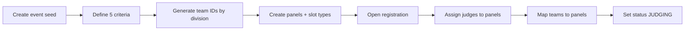
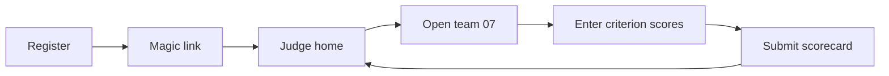
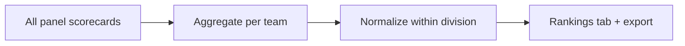

# MinneMUDAC judging demo — implementation plan

Branch: `feature/mudac-demo`

Prototype for [MinneMUDAC 2026](https://minneanalytics.org/minnemudac-2026/): volunteer judges score student team presentations across flexible criteria; tournament directors configure the event, review panel scorecards, and rank teams by division.

This demo **coexists** with the existing Data Tech conference planning flow. Shared infrastructure (Next.js, Prisma, Tailwind, `lib/tokens.ts`, validation patterns) is reused; **domain models and routes are separate** under `/mudac/*` so conference code stays untouched.

---

## Goals

| Actor | Needs |
|-------|--------|
| **Judge** (volunteer) | Self-register securely, receive a personal link, score assigned teams on N criteria, see only their panel’s teams |
| **Tournament director** | Configure criteria, panels, judge slots/types, team IDs and divisions; monitor scorecards; view aggregated and normalized rankings |
| **Student team** | Represented by a display ID (e.g. `07`); no login required for MVP |

Non-goals for MVP: student self-registration, real SSO, payment, or integration with MinneAnalytics production WordPress.

---

## Domain overview

```
MudacEvent (e.g. minnemudac-2026)
├── ScoringCriterion[]     (flexible count, ordered, max points each)
├── Division[]             (UNDERGRADUATE, GRADUATE, POST_GRADUATE + custom)
├── Team[]                 (displayId, division, optional name/school)
├── JudgePanel[]           (label, judgesPerPanel, slot type requirements)
│   └── PanelAssignment[]  (judge ↔ panel, slot index, judge type)
└── Presentation[]         (team scored by one panel at one time)
    └── JudgeScorecard[]   (one per judge on that panel)
        └── CriterionScore[] (value per criterion)
```

### Aggregation pipeline

```
Criterion scores  →  Judge subtotal (sum or weighted sum per scorecard)
                 →  Panel aggregate (sum / mean of judge subtotals; configurable)
                 →  Team presentation total
                 →  Division ranking (directors choose normalization)
```

Directors can switch normalization without re-entering scores:

- **Raw panel total** — sum of judge subtotals
- **Panel average** — mean of judge subtotals (default when panel size varies)
- **Per-judge normalized** — each judge’s subtotal ÷ max possible for that judge
- **Division z-score** — compare team totals within division (optional phase 2)

---

## Roles and permissions

| Role | Auth | Capabilities |
|------|------|--------------|
| `MUDAC_DIRECTOR` | Long-lived admin token (`/mudac/director/{token}`) | Full event config, team/panel CRUD, view all scorecards, rankings, export |
| `MUDAC_JUDGE` | Personal token after self-registration (`/mudac/judge/{token}`) | Score assigned panel’s teams only; edit own scorecards until event locked |

Enforce in **`lib/mudac/roles.ts`** and every `app/api/mudac/**` route (mirror `lib/roles.ts` pattern).

---

## Authentication and judge registration

Volunteer judges are unknown ahead of time; registration must be low-friction but not spoofable.

### Recommended flow (MVP)

1. Director opens **Registration settings** → toggles `registrationOpen`, optional **registration code** (shared secret, e.g. printed at volunteer desk).
2. Judge visits **`/mudac/{slug}/register`**.
3. Form: name, email, affiliation, **judge type** (academic / industry-business / industry-technical / general), optional preferred panel.
4. Server validates registration window + code, creates `MudacJudge` with hashed token, sends **magic link** via email stub (`lib/email-stub.ts` → console in dev).
5. Judge clicks link → **`/mudac/judge/{token}`** (session = possession of URL, same as conference demo).

### Security properties

- Tokens: `generateToken()` + `hashToken()` — only hash stored in DB.
- Rate limit registration and score POSTs (reuse pattern from `app/api/submissions`).
- Honeypot field on registration form.
- Judges cannot guess team IDs outside their panel (API checks `PanelAssignment`).
- Director can **revoke** a judge token and **lock** scoring when presentations end.

### Phase 2 (optional)

- Email OTP instead of long-lived URL for day-of login.
- Entra / Google for returning directors only.

---

## Data model (Prisma additions)

New enums and models; **no changes** to `Conference` / `Submission`.

```prisma
enum MudacEventStatus {
  DRAFT
  REGISTRATION_OPEN
  JUDGING
  LOCKED
  ARCHIVED
}

enum MudacDivision {
  UNDERGRADUATE
  GRADUATE
  POST_GRADUATE
}

enum MudacJudgeType {
  ACADEMIC
  INDUSTRY_BUSINESS
  INDUSTRY_TECHNICAL
  GENERAL
}

enum MudacIdGenerationMode {
  SEQUENTIAL   // start, end, increment
  RANDOM       // unique random in range
}

enum MudacPanelAggregateMode {
  SUM
  MEAN
}

model MudacEvent {
  id                    String   @id @default(cuid())
  slug                  String   @unique
  name                  String
  status                MudacEventStatus @default(DRAFT)
  registrationOpen      Boolean  @default(false)
  registrationCodeHash  String?  // optional bcrypt/SHA of shared code
  judgesPerPanel        Int      @default(3)
  panelAggregateMode    MudacPanelAggregateMode @default(MEAN)
  idGenerationMode      MudacIdGenerationMode @default(SEQUENTIAL)
  teamIdStart           Int      @default(1)
  teamIdEnd             Int      @default(99)
  teamIdIncrement       Int      @default(1)
  teamIdPadWidth        Int      @default(2)   // "07" vs "7"
  scoringLocked         Boolean  @default(false)
  // relations: criteria, divisions, teams, panels, judges, directors, presentations
}

model MudacScoringCriterion {
  id          String @id @default(cuid())
  eventId     String
  sortOrder   Int
  name        String
  description String?
  maxPoints   Int    @default(10)
  weight      Float  @default(1.0)   // 1.0 = unweighted
  @@unique([eventId, sortOrder])
}

model MudacTeam {
  id          String @id @default(cuid())
  eventId     String
  displayId   String          // "07" — unique per event
  division    MudacDivision
  name        String?         // optional school/team label for directors
  @@unique([eventId, displayId])
}

model MudacJudgePanel {
  id          String @id @default(cuid())
  eventId     String
  label       String          // "Panel A", "Room 101"
  sortOrder   Int
}

// Required judge-type mix per panel (flexible slots)
model MudacPanelSlotRequirement {
  id          String @id @default(cuid())
  panelId     String
  slotIndex   Int             // 0..judgesPerPanel-1
  judgeType   MudacJudgeType  // expected type for this seat
  @@unique([panelId, slotIndex])
}

model MudacJudge {
  id            String @id @default(cuid())
  eventId       String
  name          String
  email         String
  affiliation   String?
  judgeType     MudacJudgeType
  tokenHash     String @unique
  revokedAt     DateTime?
  registeredAt  DateTime @default(now())
  @@unique([eventId, email])
}

model MudacPanelAssignment {
  id        String @id @default(cuid())
  panelId   String
  judgeId   String
  slotIndex Int
  @@unique([panelId, slotIndex])
  @@unique([panelId, judgeId])
}

model MudacDirectorAccess {
  id        String @id @default(cuid())
  eventId   String
  label     String
  tokenHash String @unique
}

model MudacPresentation {
  id        String   @id @default(cuid())
  eventId   String
  panelId   String
  teamId    String
  scheduledAt DateTime?
  @@unique([eventId, teamId])   // one panel scores each team (MVP)
}

model MudacJudgeScorecard {
  id              String @id @default(cuid())
  presentationId  String
  judgeId         String
  submittedAt     DateTime?
  notes           String?
  @@unique([presentationId, judgeId])
}

model MudacCriterionScore {
  id           String @id @default(cuid())
  scorecardId  String
  criterionId  String
  value        Float
  @@unique([scorecardId, criterionId])
}
```

**Flexibility notes**

- Criteria count = rows in `MudacScoringCriterion` (director adds/removes/reorders).
- Panel size = `judgesPerPanel` + optional per-slot type requirements.
- Team ID = `displayId` string with configurable pad width; generation helper respects sequential or random mode.

---

## Business logic (`lib/mudac/`)

| Module | Responsibility |
|--------|----------------|
| `roles.ts` | Director vs judge permissions |
| `auth.ts` | Resolve token → judge/director; check revoked |
| `registration.ts` | Window, code verification, create judge + email link |
| `team-ids.ts` | Generate IDs (sequential/random), validate uniqueness |
| `panels.ts` | Assign judges to slots; validate type requirements |
| `scoring.ts` | Validate criterion values (0..maxPoints), compute judge subtotal |
| `aggregation.ts` | Panel totals, team totals, division rankings, normalization |
| `queries.ts` | Prisma loaders for director dashboard and judge queue |

### Scoring rules

- Each criterion: `0 ≤ value ≤ maxPoints` (integer or 0.5 steps — director-configurable later).
- Judge subtotal: `Σ (value × weight)` or simple sum if weights unused.
- Panel complete when all assigned judges have `submittedAt` set on scorecards.
- Incomplete panels shown separately in director views; rankings can exclude or flag incomplete.

---

## UI and routing

### Public / judge

| URL | Purpose |
|-----|---------|
| `/mudac` | Landing — link to MinneMUDAC 2026 demo event |
| `/mudac/minnemudac-2026/register` | Judge self-registration |
| `/mudac/minnemudac-2026/register/thanks` | “Check your email” + copy link in dev |
| `/mudac/judge/{token}` | Judge home: assigned panel, teams to score |
| `/mudac/judge/{token}/team/{displayId}` | Scorecard form (all criteria on one page) |

### Director

| URL | Purpose |
|-----|---------|
| `/mudac/director/{token}` | Director dashboard (tabs below) |

**Director tabs**

1. **Setup** — event status, registration open/close, registration code, lock scoring
2. **Criteria** — add/edit/reorder criteria (name, max points, weight)
3. **Teams** — division filter, bulk ID generation (start/end/increment or random), manual add
4. **Panels** — create panels, set slot judge types, assign registered judges to slots
5. **Presentations** — assign team → panel (drag or table)
6. **Scorecards** — matrix: panels × teams; drill into individual judge scorecards
7. **Rankings** — division leaderboard with panel aggregate mode toggle + CSV export

### API routes (`app/api/mudac/`)

| Method | Path | Actor |
|--------|------|-------|
| `POST` | `/api/mudac/register` | Public |
| `GET/PATCH` | `/api/mudac/director/event` | Director |
| `POST/PATCH/DELETE` | `/api/mudac/director/criteria` | Director |
| `POST/PATCH/DELETE` | `/api/mudac/director/teams` | Director |
| `POST` | `/api/mudac/director/teams/generate-ids` | Director |
| `POST/PATCH/DELETE` | `/api/mudac/director/panels` | Director |
| `POST/DELETE` | `/api/mudac/director/panel-assignments` | Director |
| `POST/PATCH/DELETE` | `/api/mudac/director/presentations` | Director |
| `POST` | `/api/mudac/scorecards` | Judge |
| `GET` | `/api/mudac/director/export` | Director |

---

## Key user flows

### Director prepares event



### Judge scores a team



### Director ranks teams



---

## Seed data (MinneMUDAC 2026)

Align with public event facts:

- **Event:** MinneMUDAC 2026, October 17, 2026, St. Catherine University
- **Client theme:** The Food Group / food insecurity (team names optional in seed)
- **Divisions:** 8 undergraduate teams, 6 graduate, 2 post-graduate (example counts)
- **Criteria (example 5):** Problem understanding, Analytical approach, Insight/impact, Presentation clarity, Q&A / teamwork
- **3 panels**, 3 judges each, mixed slot types
- **1 director token** printed to console
- **3 pre-registered judges** with tokens for instant demo (plus registration flow for a 4th)

---

## Implementation phases

### Phase 1 — Foundation (schema + director setup)

- [ ] Prisma models + `npm run db:push`
- [ ] `lib/mudac/*` core helpers
- [ ] Director token route + **Setup / Criteria / Teams** tabs
- [ ] Team ID generation API
- [ ] Seed `minnemudac-2026`

**Done when:** Director can define criteria, generate teams by division, copy director URL from seed.

### Phase 2 — Panels and registration

- [ ] Panel CRUD + slot type requirements
- [ ] Judge registration (public form + email stub link)
- [ ] Director **Panels** tab: assign judges to slots
- [ ] Revoke judge token

**Done when:** A new volunteer can register and appear in a panel assignment UI.

### Phase 3 — Scoring

- [ ] Presentations (team ↔ panel)
- [ ] Judge dashboard + scorecard form
- [ ] `POST /api/mudac/scorecards` with validation
- [ ] Scoring lock when event → `LOCKED`

**Done when:** Three judges can each score team `07` on all criteria; director sees three scorecards.

### Phase 4 — Aggregation and rankings

- [ ] `lib/mudac/aggregation.ts` — judge subtotal, panel total, team total
- [ ] Director **Scorecards** matrix + drill-down
- [ ] **Rankings** tab per division with aggregate mode toggle
- [ ] CSV export

**Done when:** Directors see ranked undergrad/grad/post-grad lists from seeded scores.

### Phase 5 — Polish and docs

- [x] `/mudac` landing page + header nav entry
- [x] `docs/exploring-mudac-demo.md` walkthrough
- [x] `docs/mudac-architecture.md` + architecture cross-links
- [x] Mobile-friendly scorecard layout (judges often use tablets)

---

## Reuse from conference demo

| Existing | MUDAC use |
|----------|-----------|
| `lib/tokens.ts` | Judge and director tokens |
| `lib/scoring.ts` | `aggregateScores` for panel means |
| `lib/email-stub.ts` | Registration magic links |
| `lib/validation.ts` + Zod | Form schemas |
| `components/SiteHeader.tsx` | Add “MUDAC demo” nav link |
| Rate limit / honeypot patterns | Registration endpoint |

Do **not** extend `ReviewerRole` or `Conference` — keep MUDAC isolated.

---

## Director UI sketches (behavior)

### Criteria editor

| # | Name | Max pts | Weight |
|---|------|---------|--------|
| 1 | Problem understanding | 10 | 1.0 |
| 2 | Analytical approach | 10 | 1.0 |
| … | + Add criterion | | |

### Team ID generator

- Mode: Sequential / Random  
- Start: `1` · End: `99` · Increment: `1` · Pad width: `2`  
- Division: Undergraduate · Count: `8` → creates `01`–`08` (or configured range)

### Rankings (undergraduate)

| Rank | Team | Panel | Judges | Panel avg | Status |
|------|------|-------|--------|-----------|--------|
| 1 | 07 | A | 3/3 | 42.3 | Complete |
| 2 | 03 | B | 2/3 | 39.1 | Partial |

---

## Open decisions (defaults proposed)

| Question | Proposal |
|----------|----------|
| Can one team be scored by multiple panels? | No for MVP (`@@unique([eventId, teamId])` on presentation) |
| Weighted criteria? | Store weights; default 1.0; UI optional in phase 1 |
| Judge edits after submit? | Allowed until director locks scoring |
| Registration without email? | Require email for MVP (magic link); optional “director assigns link at desk” copy button in phase 2 |
| Anonymous teams to judges? | Yes — judges see **display ID + division** only (no school names on scorecard) |

---

## Testing checklist

- [ ] Register judge with wrong code → 403
- [ ] Judge A cannot POST scores for team not on their panel → 403
- [ ] Criterion value above max → 400
- [ ] Panel mean with 2 of 3 judges → flagged incomplete in rankings
- [ ] Sequential ID generation respects pad width and collision
- [ ] Lock scoring → judge POST returns 409
- [ ] CSV export matches rankings tab

---

## Documentation deliverables

| File | When |
|------|------|
| `docs/mudac-implementation-plan.md` | This document (planning) |
| `docs/exploring-mudac-demo.md` | Phase 5 — evaluator walkthrough |
| `docs/mudac-routing.md` | Phase 5 — or section in `routing.md` |
| Seed output | Always print director URL + sample judge URLs |

---

## Next step

Start **Phase 1**: add Prisma models, `lib/mudac/roles.ts`, director page shell, criteria + team ID APIs, and seed for `minnemudac-2026`.
